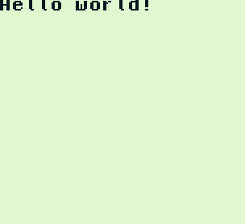

# GBTS (GameBoy TypeScript)

GBTS (GameBoy TypeScript) is a utility to transpile, compile and create Roms for GameBoy.
Stop writing your roms in C, write them in TypeScript.

This utility is based on 2 projects:
* [ts2c](https://github.com/andrei-markeev/ts2c) Transform .ts file to .c file.
* [gbdk-n](https://github.com/andreasjhkarlsson/gbdk-n) Gameboy Development Kit adapted to the new Small Device C Compiler (SDCC).
 
## Prerequisites

### SDCC
First of all you need the C compiler. This will allow you to compile applications written in C for small devices.

Download and install SDCC:
#### Windows : 

Download the latest version of SDCC :
* [https://sourceforge.net/projects/sdcc/files/sdcc-win64/](https://sourceforge.net/projects/sdcc/files/sdcc-win64/)

Currently the latest version of SDCC is 3.9.0. The file to download is `sdcc-3.9.0-x64-setup.exe`.

Once the installer is downloaded, run it to install the compilation chain, paying attention to the following two points:

* Make sure the “SDCC GBZ80 library” box is checked.
* At the end of the installation, make sure the “Add C: \ ... to the PATH” box is checked too.

#### Linux (Debian and Ubuntu) : 

Just execute the following command : `sudo apt install build-essential sdcc sdcc-libraries`.

### NodeJS

NodeJS `8` is required.

## Usages

* 1 - Install dependencies : `npm install`.
* 2 - Build : `npm run build`. 

For now use the start script : `npm start`. 
This command requires parameters (`npm start -- [--<option>]`, ex : `npm start -- --path <path_to_.ts_file>`). 

| Option    | Description                               | Example                           |
|-----------|-------------------------------------------|-----------------------------------| 
| help      | show help                                 | `npm start -- --help`             |
| version   | show version number                       | `npm start -- --version`          |
| path      | Path to .ts file to be transpiled to .c   | `npm start -- --path C:/hello.ts` |

## The famous 'HelloWorld' ! 

Once the prerequisites have been completed, let's write your first hello workd on GameBoy. 
his tutorial works on windows and uses the emulator BGB. (it can be downloaded [here](https://bgb.bircd.org/))

#### Step 1 
White a `hello.ts` TypeScript file whith the following content : `console.log("Hello World!")` and nothing else ...
 
#### Step 2 
After installing the GBTS dependencies (`npm install`).
Go to the root directory of GBTS and type the following command: `npm start -- --path <path_to_hello.ts>`.

#### Step 3

Once the step 2 finished, start `bgb.exe` and drag and drop the `hello.gb` one the GBG screen. 

You should see the following image appear :
 
  

Congrats !   

## Next developments

* I am working on the use of gbdk libraries (gb / gb.h for example). Compiling by referring to headers does not work for the moment: [See issue here](https://github.com/andrei-markeev/ts2c-target-esp-idf/issues/1)
* I am trying to deploy gbts as a node module. An error occurs on Windows when launching the gbts command once deployed.
See : [Stackoverflow issue](https://stackoverflow.com/questions/65136317/installing-locally-and-globally-a-npm-depency-produces-an-error-while-executing).
